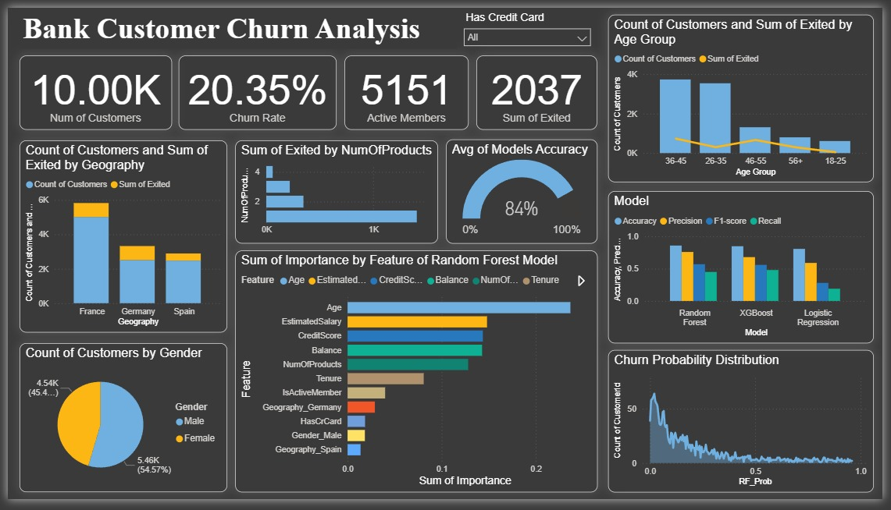

# 🚀 Bank Customer Churn Prediction System

## 📌 Project Overview
This project is part of **Future Interns – Machine Learning Task 2**.  
The goal is to build a **Churn Prediction System** that identifies which customers are likely to leave a service.  
Such predictions help businesses (telecom, banking, SaaS, etc.) focus on **customer retention**.

We used **Logistic Regression, Random Forest, and XGBoost** to train models and compared their performance.  
The final results are presented in a **Power BI Dashboard**.

---

## 🛠️ Tools & Libraries
- **Python** → Data preprocessing, ML model training  
- **Pandas, NumPy, Scikit-learn, XGBoost** → Data wrangling, modeling, evaluation  
- **Power BI** → Dashboard for visualization & storytelling
  
---

## 📊 Dataset
We used the **Bank Customer Churn dataset** containing customer demographic and account features.

### Key Columns:
- `CustomerId` – Unique identifier  
- `Geography` – Country of customer  
- `Gender` – Male / Female  
- `Age` – Customer age  
- `Balance` – Account balance  
- `CreditScore`, `Tenure`, `NumOfProducts`, `EstimatedSalary`  
- `Exited` – Target variable (1 = churned, 0 = retained)
  
[📂 Download the full Dataset](https://www.kaggle.com/datasets/adammaus/predicting-churn-for-bank-customers)
  
---

## 🤖 Models & Performance

### Logistic Regression
- **Accuracy**: 0.808  
- Struggles with minority class (churners), recall only **0.19**

### Random Forest
- **Accuracy**: 0.859  
- Better balance, recall improved to **0.45**

### XGBoost
- **Accuracy**: 0.849  
- Similar to Random Forest, slightly better precision for churn class  

| Model               | Accuracy | Precision (Churn=1) | Recall (Churn=1) | F1 (Churn=1) |
|----------------------|----------|---------------------|------------------|--------------|
| Logistic Regression  | 0.808    | 0.59                | 0.19             | 0.28         |
| Random Forest        | 0.859    | 0.76                | 0.45             | 0.57         |
| XGBoost              | 0.849    | 0.68                | 0.48             | 0.56         |

---

## 📈 Power BI Dashboard

- 📂 Download the full interactive dashboard here:
[➡️ Customer Churn Prediction & Analysis Dashboard.pbix](churn_dashboard.pbix)

---

## 📌 How to Run

### 1. Model Training (Python)
- Run [code](churn_code.ipynb) for EDA & model training  
- Predictions and feature importance are saved as CSV  

### 2. Power BI Dashboard
- Open [powerbi_dashboard.pbix](churn_dashboard.pbix) in Power BI Desktop  
- Refresh data connections (CSV from outputs/)  

---

## 📜 Conclusion
This project demonstrates how **machine learning + business dashboards** can work together to:
- Predict customer churn  
- Explain key drivers behind churn  
- Help decision-makers **target high-risk customers** for retention  
